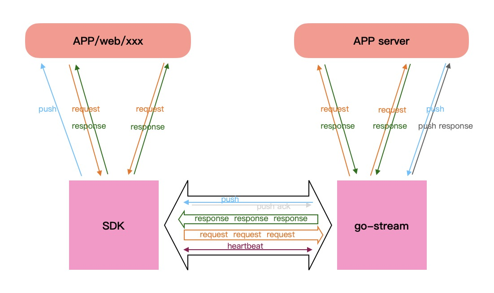

# go-stream
基于go实现长连接的处理，把长连接数据按照使用的协议转切分为请求(request)，
与后端服务器使用短连接通讯，完全兼容后端http协议。后端服务器使用推送协议可以
很方便的把数据推送到客户端。   
  
  
   
## Net  
MaxConnections 设置最大连接数，-1表示不限制  
TLS 是否使用TLS, 如果设置为true，则必须设置TlsFile，使用PEM格式的证书文件格式  
  
## HeartBeat_s 
设置心跳，在握手协议中，此设置会同步给客户端。

## proxy   
### Headers   
* Key 按照标准的Http头的格式配置，内部会自动转换为标准的格式(首字母大学，其他字母小写)  
* Value 支持使用[变量](#var)
* 所有客户端在请求时填写的头信息都会自动填充在Proxy的Headers中
### Url
后端服务的地址，支持使用[变量](#var)

## push
### push server
接收后端应用服务器向客户端推送的数据。
后端应用服务器需要的推送相关的数据，可以通过[proxy Headers](#proxyHeaders) 
传递给后端服务器。
### push client sdk
* push sdk中url的必须是 host:ip/pushtoken 的格式，host与ip必须与push服务中配置的一样，pushtoken是[变量](#var)的值。
  host:ip可以是[xtcp](https://github.com/xpwu/go-xnet) 中支持的任何地址协议
* 直接 require 本模块，使用pushc.PushData(xxx) or pushc.Close(xxx) 即可

## websocket
* Origin 设置允许发起websocket请求的源，如果源与请求的Host相同时，无论Origin设置什么都允许访问。  
支持* 通配符，比如："*"，允许所有的源请求；"\*.adc.com"，允许.adc.com结尾的域名发起访问

## 变量
* 在支持变量的配置中，由${xxx}格式表示一个变量xxx，变量的值会根据当前的请求或者连接而获取
* 基于连接的变量：在同一连接上的所有请求在获取基于连接的变量值时，都是同一个值  
> pushtoken 供推送时使用  
 remote_addr 远端地址  
 local_addr 本地地址
* 基于请求的变量：  
> fhttp_xxx xxx是客户端请求时，添加的头信息的key

## client
对应的client sdk 在 [这儿](https://github.com/xpwu/streamclient) 

## go-client
go版本的client与push sdk 在 [这儿](https://github.com/xpwu/go-streamclient)

## sever
使用此库实现的独立服务在 [这儿](https://github.com/xpwu/streamserver)

## push demo
go版本的push [demo](https://github.com/xpwu/go-pushdemo) 